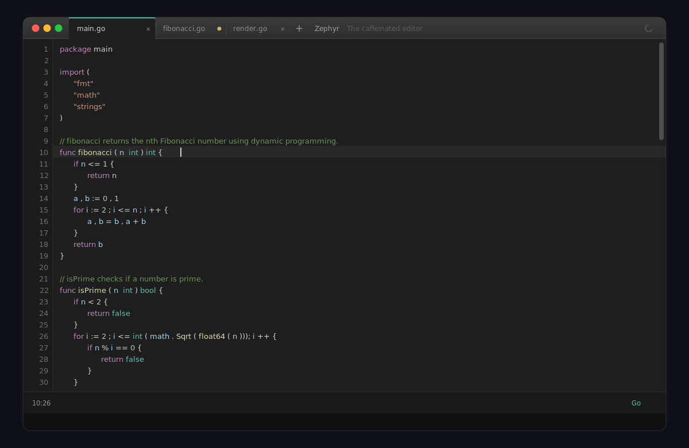
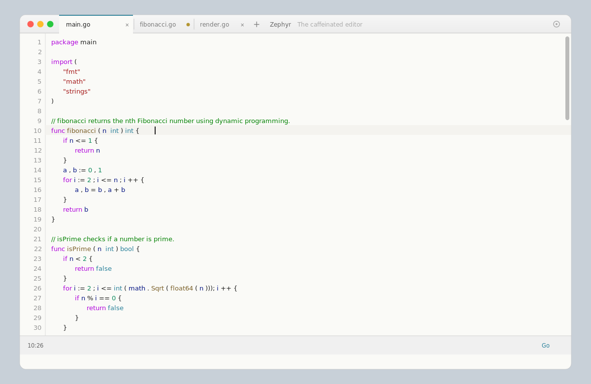
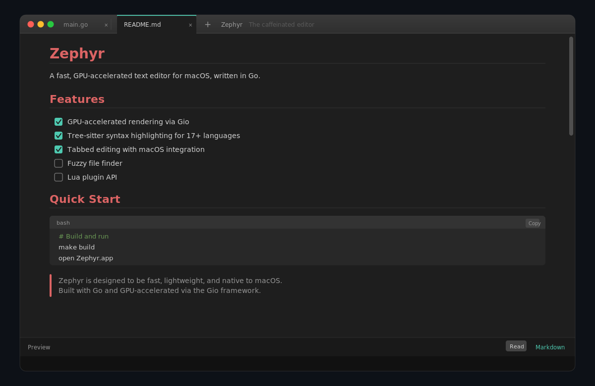

<p align="center">
  
</p>

<h1 align="center">Zephyr</h1>
<p align="center"><strong>The caffeinated editor</strong></p>

<p align="center">
  A fast, GPU-accelerated text editor for macOS, written entirely in Go.<br/>
  Powered by <a href="https://gioui.org">Gio</a> for buttery-smooth rendering and <a href="https://tree-sitter.github.io/tree-sitter/">Tree-sitter</a> for precise syntax highlighting.
</p>

<p align="center">
  
  
  
  
</p>

---

<p align="center">
  
</p>

## Why Zephyr?

Most editors are either fast and ugly, or pretty and slow. Zephyr aims to be both — a native macOS editor that renders every frame on the GPU while staying lightweight and responsive. No Electron, no web views, no compromises.

## Features

- **GPU-accelerated rendering** — every pixel drawn on the GPU via [Gio](https://gioui.org), delivering smooth scrolling and instant response
- **Tree-sitter syntax highlighting** — accurate, incremental parsing for 17+ languages including Go, Python, JavaScript, TypeScript, Rust, C, C++, Java, Ruby, Lua, and more
- **Tabbed editing** — Chrome-style tab bar with drag-to-reorder, overflow dropdown, and unsaved-changes indicators
- **Markdown preview** — rendered markdown with code blocks, task list checkboxes, tables, and copy buttons
- **Native macOS integration** — app bundle with custom titlebar, traffic lights, and native Save/Save As dialogs
- **Smart editing** — auto-pairing brackets and quotes, language-aware indentation, soft-tab backspace
- **Undo/redo** — with intelligent operation coalescing so each undo step feels natural
- **Find and replace** — inline search with regex and case-sensitive modes
- **Dark and light themes** — configurable via JSON, with automatic system appearance detection
- **Language selector** — switch syntax highlighting from the status bar

<details>
<summary><strong>Dark and light themes</strong></summary>
<br/>
<p align="center">
  
  &nbsp;&nbsp;
  
</p>
</details>

<details>
<summary><strong>Markdown preview</strong></summary>
<br/>
<p align="center">
  
</p>
</details>

### Roadmap

Architectural foundations exist for these features:

- Fuzzy file finder
- Command palette
- Multiple cursors
- File tree sidebar
- File watching for external changes
- Lua plugin API

## Getting Started

### Build

```bash
make build
```

### Run

```bash
make run ARGS=myfile.txt
```

### macOS App Bundle

```bash
make app
open Zephyr.app
```

### Test

```bash
make test
```

### Benchmark

```bash
make bench
```

## Keyboard Shortcuts

| Shortcut | Action |
|---|---|
| `Cmd+S` | Save |
| `Cmd+Shift+S` | Save As |
| `Cmd+T` | New tab |
| `Cmd+W` | Close tab |
| `Cmd+Q` | Quit |
| `Cmd+Z` | Undo |
| `Cmd+Shift+Z` | Redo |
| `Cmd+A` | Select all |
| `Cmd+C` / `Cmd+X` / `Cmd+V` | Copy / Cut / Paste |
| `Cmd+F` | Find |
| `Cmd+Shift+F` | Find and replace |

## Architecture

Zephyr is built with a clean separation of concerns:

```
cmd/zephyr/     Main application, UI layout, and event loop
internal/
  buffer/       Piece table data structure for efficient text editing
  editor/       Core editor state — cursor, selection, undo history
  highlight/    Tree-sitter integration for syntax highlighting
  render/       GPU rendering — text, gutter, cursors, markdown, scrollbar
  ui/           UI components — tabs, find bar, language selector, status line
  config/       Themes, fonts, and configuration
  plugin/       Lua plugin API framework
```

## License

[MIT](LICENSE)
